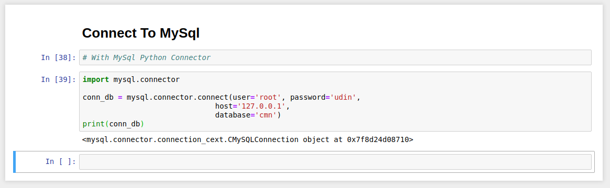

# Start Data Science 

 This project of my case study for Data Science use Jupyter and other tools, I hope from this litle docs help another you need for learn process, thanks

# Connecting to Mysql Database

<ul>
    <li>
        
First, Install <a href="https://dev.mysql.com/doc/connector-python/en/connector-python-installation.html">MySql Python Connector</a> 
          $ pip install mysql-connector-python 

    </li>
    <li>
        
After installation process done, you can try this code : 

        
    </li>
</ul>

