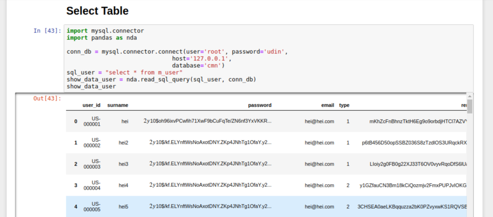
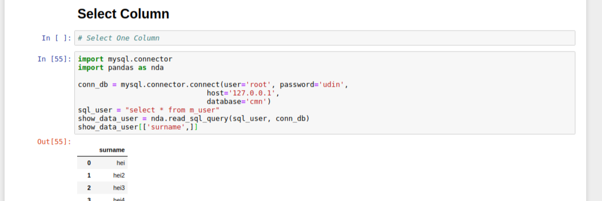

# Start Data Science | Pandas X MySql

 This project of my case study for Data Science use Jupyter and other tools, I hope from this litle docs help another you need for learn process, thanks

# Connecting to Mysql Database

<ul>
    <li>
        
First, Install <a href="https://dev.mysql.com/doc/connector-python/en/connector-python-installation.html">MySql Python Connector</a> 
        

        <code>$ pip install mysql-connector-python</code> 
    </li>
    <li>
        
After installation process done, you can try this code : 

        <ul>
            <li>
                
Connect to Mysql Database and test with print()

                
            </li>
        </ul>
    </li>
</ul>

# Select Table & Column

<ul>
    <li>
        

            Select table with sql("select * from name_table"), but Firstly, add library or pandas tools for make cool data visualization
        

        <code>$ import pandas as another_aliases</code>
        
for this example use <b>DataFrame</b>

        
    </li>
    <li>
        
<b>Select Column</b> Or Filtering(index & select data)

        

            # Select one column
        

        
         
        

            # Select multiple column
        

            
    </li>
    <li>
        
<b>Checking Data Type of Visualization</b>

        

            if you want to chek type data visualization, just simple. you can check with general code on python, 
            and enter
        

        <code> $ type(variable_data_name)</code>
        
then you can see type of data visualization used.

        
    </li>
</ul>

